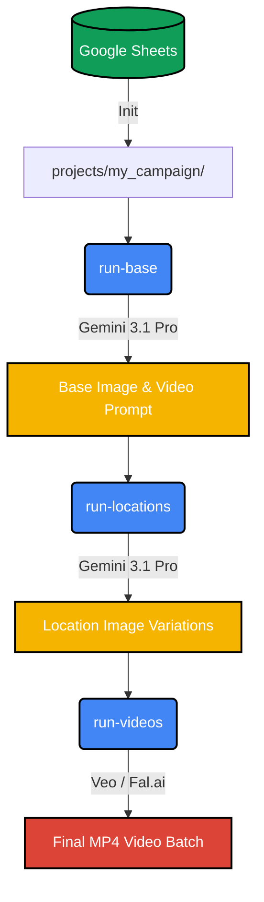

# AI Influencer Pipeline 🎬

A modern, multi-project pipeline to generate AI influencer images and videos consistently using Gemini and Fal.ai.

## 🛠️ Setup

1. **Install Dependencies:**
   ```bash
   uv sync
   ```
2. **Configure Secrets:**
   Copy `.env.example` to `.env` and fill in your API keys (Google Gemini, Fal.ai, and Google credentials).

## 🚀 The Workflow

This pipeline is designed for an intuitive, step-by-step generation process with built-in manual review points.

### 1. Initialize a Project
**What it does:** Creates a local workspace for your project and connects it to your Google Sheet. It immediately tests your API credentials, pulls down your settings, and even auto-populates the Google Sheet with default templates if it's completely blank!
```bash
uv run python main_pipeline.py init "my_campaign" --sheet-id "1BxiMvs0XRX5Y..."
```

### 2. Generate Base Scene (Step 1)
**What it does:** Reads your "Initial Image Prompt" from the Google Sheet and generates exactly **one** master base image using Gemini 3.1 Pro. It then uses Gemini to dynamically rewrite that image prompt into a high-quality video prompt.
**Why stop here?** So you can visually review the base image in your `projects/my_campaign/images/` folder and tweak your prompt until you have the perfect character *before* you spend money generating dozens of variations!
```bash
uv run python main_pipeline.py run-base "my_campaign"
```

### 3. Generate Location Variations (Step 2)
**What it does:** Reads your list of "Locations" from the Google Sheet. For every location, it asks Gemini to modify your original prompt to place the character in the new background. It then generates the new images *while explicitly referencing your base image* to guarantee the character's face and style remain consistent across all locations.
**Why stop here?** So you can review all the newly generated location images to ensure they look perfect before sending them to the expensive video generation AI.
```bash
uv run python main_pipeline.py run-locations "my_campaign"
```

### 4. Generate Final Videos (Step 3)
**What it does:** Takes every single location image and its corresponding video prompt, and sends them in bulk to the Veo / Fal.ai video generation API. It waits for the generations to finish, downloads the high-quality `.mp4` files directly to your local folder, and automatically logs the final file paths back into your Google Sheet's "OUTPUTS" tab.
```bash
uv run python main_pipeline.py run-videos "my_campaign"
```

## 📊 Dashboard Visualization (Optional)

When you run the commands above, you will see a log saying *"Starting temporary server on http://127.0.0.1:8521"*. **You can completely ignore that link!** It is just raw internal data.

If you actually want to watch your pipeline run in real-time on a beautiful dashboard, open a second terminal and run our built-in dashboard command:
```bash
uv run python main_pipeline.py dashboard
```
Then visit **`http://127.0.0.1:4200`** in your browser.

## 🏗️ Pipeline Architecture


