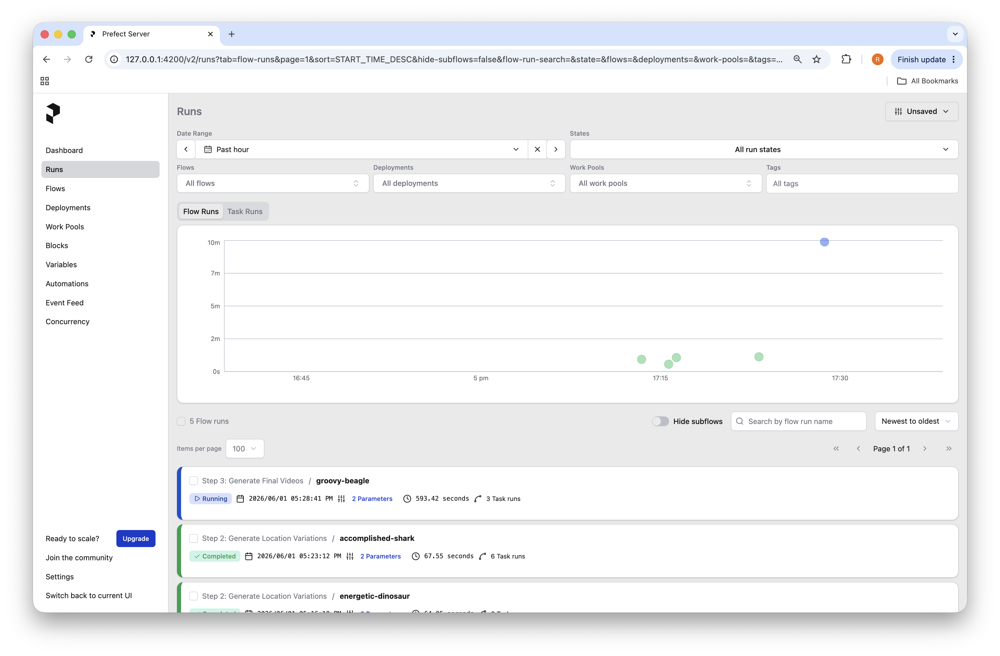
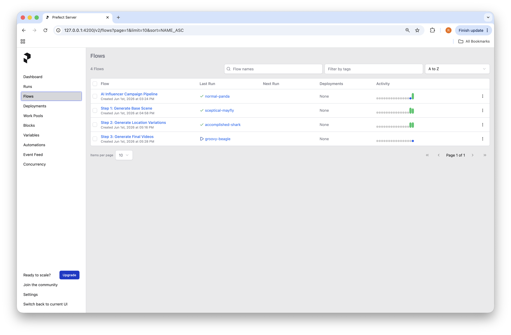
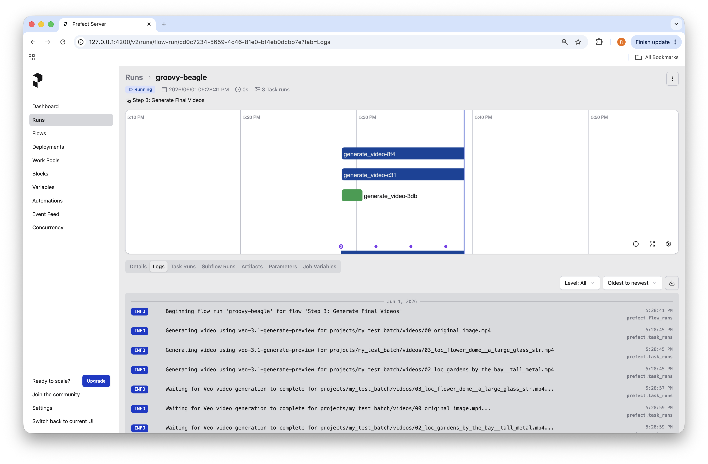
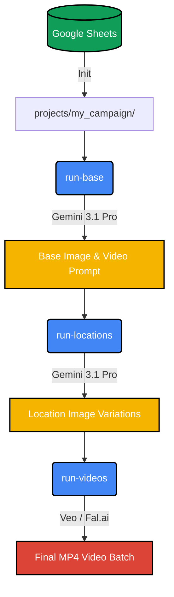

# AI Influencer Pipeline 🎬

A modern, multi-project pipeline to generate AI influencer images and videos consistently using Gemini and Fal.ai.

## 🛠️ Setup

1. **Install Dependencies:**
   ```bash
   uv sync
   ```
2. **Configure Secrets:**
   Copy `.env.example` to `.env` and fill in your API keys (Google Gemini, Fal.ai, and Google credentials).

## 🚀 The Workflow

This pipeline is designed for an intuitive, step-by-step generation process with built-in manual review points.

### 1. Initialize Project
Creates workspace & syncs with Google Sheets.
```bash
uv run python main_pipeline.py init "my_campaign" --sheet-id "1BxiMvs0XR..."
```

### 2. Base Scene (Step 1)
Generates **one** master base image & video prompt.
*Review image in `projects/my_campaign/images/` before proceeding.*
```bash
uv run python main_pipeline.py run-base "my_campaign"
```

### 3. Location Variations (Step 2)
Generates character-consistent images across all new locations.
*Review images to ensure perfection before generating videos.*
```bash
uv run python main_pipeline.py run-locations "my_campaign"
```

### 4. Final Videos (Step 3)
Bulk generates `.mp4` videos via Veo/Fal and updates your Sheet.
```bash
uv run python main_pipeline.py run-videos "my_campaign"
```

## 📊 Web Dashboard

Monitor generation progress, logs, and costs in real-time.

**Start the dashboard:**
```bash
uv run python main_pipeline.py dashboard
```
*(Open `http://127.0.0.1:4200` in your browser)*

### 1. Overview
See active and past pipeline runs at a glance.


### 2. Jobs
Track the status of individual generation steps.


### 3. Live Logs & Artifacts
Click any job to view live logs, Prompts, and Cost Receipts.


## 🏗️ Pipeline Architecture



## 🎬 Example Output

Here is a raw, unedited AI output generated by this pipeline:

<video src="media/example_video.mp4" controls="controls" width="100%"></video>

*(Alternatively, [watch it on YouTube](https://www.youtube.com/watch?v=t2WRpRqIz6s))*
